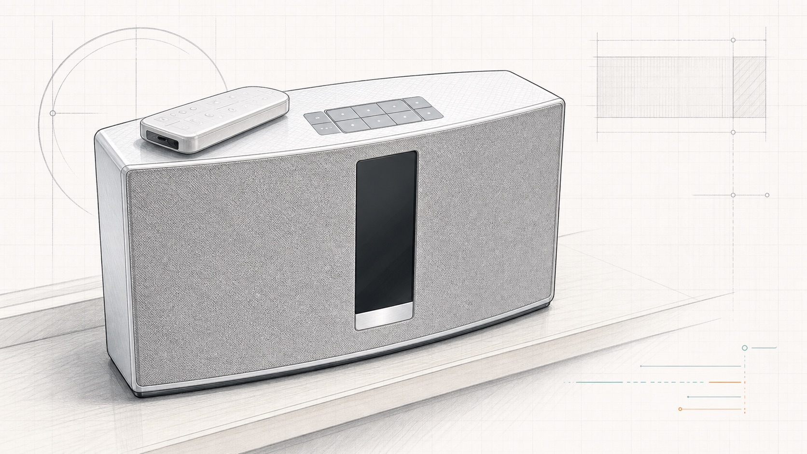

# soundtouch-radio-bridge

Restore Bose SoundTouch physical preset buttons to direct web radio streams
without depending on Bose-hosted radio catalogs, whose cloud support ended in
May 2026.

Note: this needs a small server running on your local network.

Transparency note: this is an alpha, AI-assisted project developed with OpenAI
Codex under human direction and tested on one real SoundTouch setup.

The Python package and command-line tool are named `soundtouch-radio`.



This is a small local bridge for SoundTouch speakers that still expose the LAN
HTTP, websocket, and DLNA/UPnP renderer APIs. It stores harmless local preset
markers on the speaker, listens for physical preset-button selection events, and
then asks the speaker to play the configured direct stream URL.

## Why This Exists

Some SoundTouch speakers are still perfectly good radios and Bluetooth/DLNA
speakers, but their cloud-backed radio catalog and preset behavior are now
unavailable. The hardware buttons may still work, the speaker may still expose
its local LAN APIs, and direct radio stream URLs may still play fine.

`soundtouch-radio` is for that situation: a SoundTouch speaker with working LAN
APIs and a small always-on local server. It lets you keep using the physical
preset buttons as simple local triggers for your own web-radio stream list. The
speaker remains the audio player: it fetches the stream directly from the radio
provider, while this bridge only sends local control commands. That makes it a
small, private-LAN repair layer rather than a cloud replacement service.

This can be useful if you want to:

- restore preset buttons `1` to `6` for web radio;
- keep an older SoundTouch speaker useful after cloud catalog support changes;
- run everything on a local server, NAS, Raspberry Pi, or always-on desktop;
- avoid continuous polling while still reacting quickly to button presses;
- give non-technical household users a simple web page for station and volume
  control.

## How It Works

```text
physical preset button
  -> Bose selects a local marker preset
  -> soundtouch-radio receives nowSelectionUpdated over the Bose websocket
  -> soundtouch-radio sends the configured stream URL to the Bose DLNA renderer
  -> Bose fetches and plays the radio stream directly
```

The bridge is control-plane only. It does not proxy, transcode, or relay audio.

```text
radio stream server  --->  Bose speaker
                  audio path

soundtouch-radio    --->  Bose speaker
                  control path only
```

## Requirements

- Python 3.11 or newer.
- LAN access from the bridge host to the SoundTouch speaker.
- Direct `http://` audio stream URLs that the speaker can fetch.
- One to six SoundTouch preset slots available for marker presets.

The tested SoundTouch path is event-driven by default. It keeps one websocket
connection open and does not poll while idle. Optional recovery burst polling is
available for diagnostics or unreliable networks, but it is off by default.

## Install

For development or local use, prefer `uv`:

```sh
uv run --extra dev soundtouch-radio --help
```

For an editable user install:

```sh
uv tool install --force --editable .
```

Docker is also supported:

```sh
docker build -t soundtouch-radio:local .
```

## Configuration

Copy the generic sample and edit the device IP, station names, and stream URLs:

```sh
cp stations.example.toml stations.toml
```

Minimal example:

```toml
[device]
host = "192.0.2.10"
api_port = 8090
dlna_port = 8091
name = "Kitchen SoundTouch"

[[station]]
slot = 1
name = "Example Radio One"
source = "UPNP"
source_account = "UPnPUserName"
location = "http://stream.example.com/radio-one.mp3"
marker_source = "AUX"
marker_source_account = "AUX"
marker_location = "/local/aux"
marker_name = "AUX IN 1"
```

Playback fields describe the stream that should be played after a button press:

- `source = "UPNP"`
- `source_account = "UPnPUserName"`
- `location = "http://..."`

Marker fields describe what is written to the physical Bose preset slot:

- `marker_source`
- `marker_source_account`
- `marker_location`
- `marker_name`

Marker entries must be distinct per preset slot. Reusing the exact same marker
for multiple slots can cause the Bose preset store to collapse those slots into
one entry.

See [examples/berlin.stations.toml](examples/berlin.stations.toml) for a
six-button Berlin radio example.

## Program Presets

Read commands are safe by default. Commands that write to the speaker require
`--yes`.

Preview the preset XML first:

```sh
uv run --extra dev soundtouch-radio --stations stations.toml presets program --dry-run
```

Write presets after backing up existing Bose presets:

```sh
uv run --extra dev soundtouch-radio --stations stations.toml presets program --yes
```

Backups are written under `backups/` as XML and JSON. Backup data is ignored by
Git.

## Run The Bridge

Default runtime is websocket-only and DLNA playback:

```sh
soundtouch-radio --json --stations stations.toml bridge run
```

Equivalent explicit form:

```sh
soundtouch-radio --json --stations stations.toml bridge run \
  --mode websocket \
  --playback-method dlna \
  --recovery-window 0
```

Optional bounded recovery window:

```sh
soundtouch-radio --json --stations stations.toml bridge run \
  --recovery-window 5 \
  --recovery-poll-interval 0.25
```

With recovery enabled, the bridge only polls after generic Bose activity/error
websocket messages and stops when the recovery window expires. It does not poll
continuously while idle.

Polling-only diagnostics:

```sh
soundtouch-radio --json --stations stations.toml bridge run \
  --mode poll \
  --poll-interval 0.5
```

## Web Control Panel

The `serve` command runs the websocket bridge and a local web control panel:

```sh
soundtouch-radio --stations stations.toml serve \
  --bind 0.0.0.0 \
  --web-port 8788 \
  --playback-method dlna \
  --recovery-window 0
```

The page provides:

- six editable station slots;
- direct play controls for each configured stream;
- volume and transport controls;
- listener status from the websocket bridge;
- manual health checks for `/info`, `/now_playing`, `/nowSelection`, and
  `/volume`.

The page refreshes status from the local `soundtouch-radio` process, not from
the speaker. The Bose is only queried by user actions such as play, volume, and
manual health checks, or by the websocket bridge itself. Station edits rewrite
the configured TOML file atomically and preserve marker fields.

An optional local speaker image can be shown without adding a site-specific
asset to this package:

```sh
soundtouch-radio --stations stations.toml serve \
  --device-image /path/to/speaker.jpg
```

The web UI has no built-in authentication. Bind it only to a trusted private
LAN interface or put it behind your own authenticated proxy.

If station editing is enabled in Docker, the container user must be able to
write the mounted TOML file. The Compose example shows a `user:` override for
that case.

## Playback Test

This changes what the Bose is playing, but does not write presets:

```sh
uv run --extra dev soundtouch-radio --stations stations.toml play 1 --yes
```

The default playback method is `dlna`, which uses the Bose UPnP renderer. The
older `--method select` path remains available for diagnostics, but it is not
reliable for audible playback on every speaker/firmware state.

## Diagnostics

```sh
uv run --extra dev soundtouch-radio --stations stations.toml --json doctor --live
uv run --extra dev soundtouch-radio --stations stations.toml --json device info
uv run --extra dev soundtouch-radio --stations stations.toml --json device now-selection
uv run --extra dev soundtouch-radio --stations stations.toml --json device now-playing
uv run --extra dev soundtouch-radio --stations stations.toml --json presets list
uv run --extra dev soundtouch-radio --stations stations.toml --json stations validate
```

Capture raw websocket events:

```sh
uv run --with websocket-client python scripts/capture_events.py 192.0.2.10 --seconds 90
```

Capture changing selection/playback state:

```sh
uv run --extra dev python scripts/capture_state.py 192.0.2.10 --seconds 30
```

Raw API escape hatch:

```sh
uv run --extra dev soundtouch-radio --stations stations.toml --json request GET info
```

Raw writes require `--yes`.

## Docker Compose

The generic Compose example is [deploy/docker-compose.example.yml](deploy/docker-compose.example.yml).
Keep site-specific Compose files, station selections, secrets, host paths, and
operational runbooks in your own infrastructure repository rather than in this
package.

## Development

Run the full local check suite:

```sh
make verify
```

That runs:

```sh
uv run --extra dev ruff check .
uv run --extra dev ruff format --check .
uv run --extra dev pytest
```

Build the Python package:

```sh
uv build
```

## Known Limits

- The Bose physical preset path is used as a marker, not as the final playback
  path.
- The bridge must be running for physical buttons to restore web-radio playback.
- Stream playback continues on the Bose if the bridge stops, but future button
  presses are no longer repaired.
- The built-in web UI is intended for trusted private LAN use and does not
  provide authentication.

## Project Status

`0.2.0a1` is an alpha release. It is useful, tested on one SoundTouch 20 setup,
and intentionally conservative, but it still needs broader device and firmware
feedback.

The implementation and documentation were developed with substantial assistance
from OpenAI Codex in an interactive workflow. The project is published because
it works on the author's hardware, not because it has broad device coverage yet.
